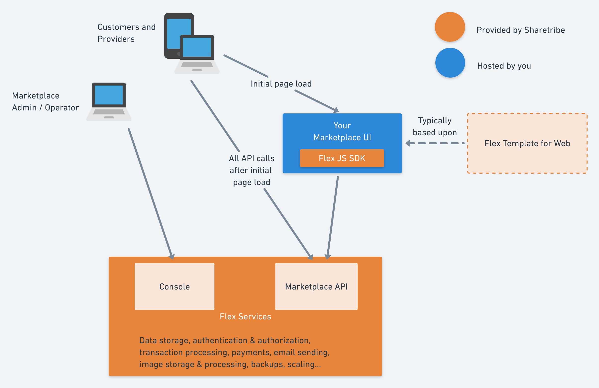

## Introduction

Sharetribe Flex is a total solution to build your own sharing economy platform. Flex provides all the necessary infrastucture to get you started fast. Because of it's headless architecture, Flex gives you total freedom to customize your user experience. As you grow, you don't have to worry about running and scaling your backend but can instead focus on the unique value of your platform.

## Flex Components

### Your Marketplace UI

Your Marketplace UI is how your users interact with your platform. Here your users can sign up, post listings, and find services to book. Your Marketplace UI, whether that's a Web UI, a Mobile application or both, is the face your solution. That's why you have total control over it.

We offer a full web template, [Flex Template for Web](/references/ftw/), to get you started with your Marketplace UI in no time but there's no limits for how much you can customize the template. You can freely alter the look and feel of your marketplace and design the user interactions. You can also integrate any web analytics or customer service solution directly into your UI. And if you're feeling adventurous, you can build the entire UI from scratch yourself.

### The Marketplace API

The Marketplace API is how your UI connects to the Flex services. It's a standard REST JSON API that allows you to implement all the standard marketplace functionality that Flex supports.

Sharetribe handles running and scaling the Marketplace API. To take full advantage of this, we suggest you design your Marketplace UI in a such a way that majority of the traffic is pointed directly by the Marketplace API. For example, the Flex Template for Web only handles the initial page load when a user opens their browser and let's the client application (Single-page application) talk directly to the Marketplace API to serve all further interactions.

Learn more about the capabilities of the Marketplace API and Flex by reading the [API reference documentation](/references/api/).

### Flex Javascript SDK

[The Flex Javascript SDK](/references/js-sdk) is a small Javascript library that makes integrating the Marketplace API a breeze. It handles tasks like authentication and session management and makes it easy to user correct data types with the API. Using the Flex JS SDK is not required but if you are working with Javascript we strongly encourage you to have a look.

### Console

Console is a place for you to manage all your marketplace data such as users, listings and transactions. Console also offers tools to develop your marketplace. Console is accessed via a web UI that we provide out of the box. Think of it as an admin interface you never have to build!

## How you use Sharetribe Flex

When building a platform with Flex, your job is to provide the Marketplace UI. We handle everythign else for you. If your Marketplace UI is a web UI then you must also host it somewhere. If you're new to Flex, we recommend starting out with the [Flex Template for Web](/references/ftw/). The template comes with instructions how to easily set it up on your local machine as well as how to host it in the [Heroku](https://heroku.com/) PaaS platform.

