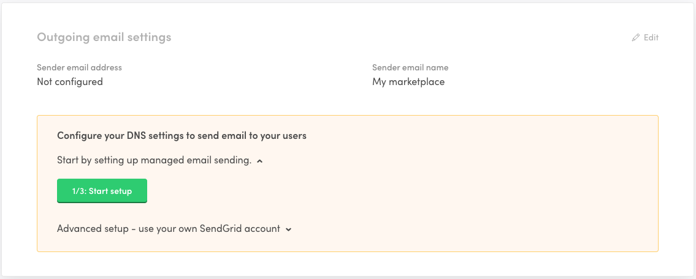

Settings up reliable email delivery is crucial for your marketplace to
work properly. It is also important to brand your email sending name and
address to look professional and polished.

Flex uses [SendGrid](https://sendgrid.com/) as an email service
provider. We manage your SendGrid account and settings automatically,
and the costs are included in your Flex subscription.

When you have your production environment created and you have bought
your custom domain for it, you should set up and validate the outgoing
email settings. Follow the steps below, and you can be sure that your
emails will be delivered reliably.

## 1. Add sender name and address

Make sure you select your production environment in the top navigation
in Console. Then head on to the General settings page in the Build
section. You can see the outgoing email settings below the marketplace
information:

Click on the "1/3 Start setup" button to start the setup. Follow the
instructions in the UI.

When you have added your sender email information, you will be prompted
with DNS information:

At this point we have created a SendGrid subuser for you, stored the
information, and authenticated the given sender domain to SendGrid. This
means that you have allowed this SendGrid subuser to send emails from
this domain.

## 2. Configure DNS

Next you need to point your DNS entries from your DNS provider to
SendGrid. This is an important step for your sender reputation and your
email deliverability. You should add all the records in the table
visible in Console.

If you have troubles adding the records for your DNS provider, see the
SendGrid article on
[Troubleshooting Sender Authentication](https://sendgrid.com/docs/ui/account-and-settings/troubleshooting-sender-authentication/).

## 3. Validate DNS

When you have configured your DNS, you still need to validate the
records for your emails to work. You can do that by clicking on the "3/3
Validate" button in Console. If everything is set up corre tly, you
should see a success message in Console:

Whenever you change your DNS records, you can revalidate to check that
everything is set up correctly.

**NOTE:** If you want to change the domain and already have an existing
domain in an active marketplace, you can
[contact Sharetribe support](mailto:flex-support@sharetribe.com) and we
can guide you to ensure that no emails are lost in the domain change.

## Summary

In this article we went through the setup to configure a custom email
address for you production marketplace. It is important to get all the
steps done and validated to ensure that emails are working reliably.

If you have any questions or need a more advanced setup, you can
[contact Sharetribe support](mailto:flex-support@sharetribe.com) and we
are happy to help you.
