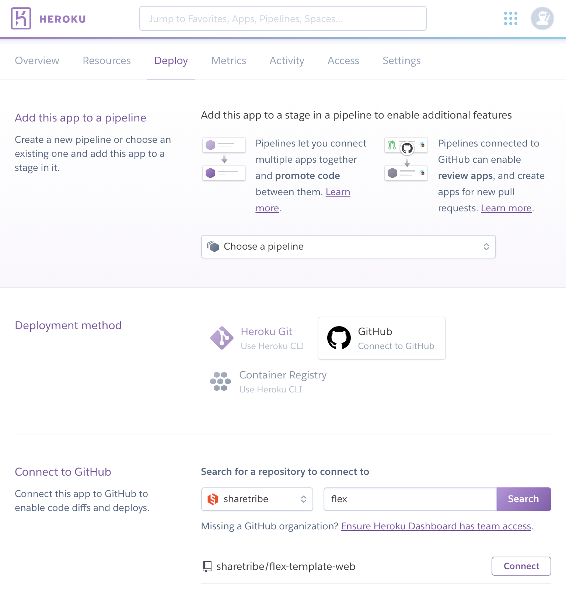
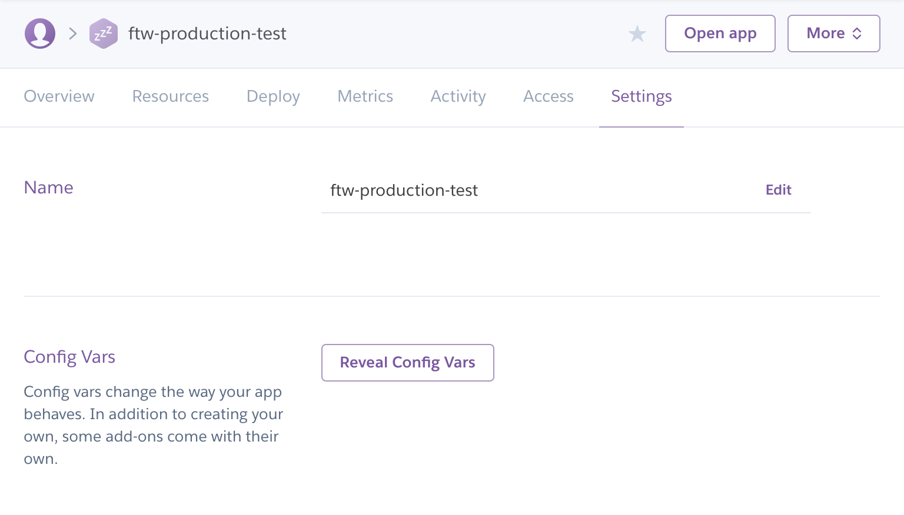
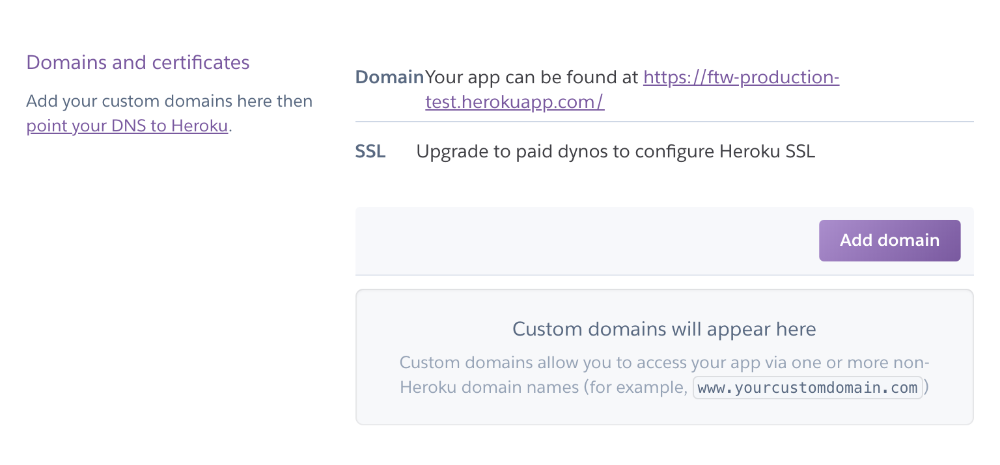

## Getting started

The easiest way to get started is deploying the application to Heroku.
Before creating the app you need three accounts:
[Heroku](https://www.heroku.com/), [Stripe](https://stripe.com/) and
[Mapbox](https://www.mapbox.com/). Creating the accounts is free unless
you start heavily using them.

Read more from [detailed Heroku instructions](#deploying-to-heroku) with
a deploy-to-Heroku button.

In other production environments, make sure that you have
[Node.js](https://nodejs.org/) and [Yarn](https://yarnpkg.com/)
installed. You will also need accounts to Stripe and Mapbox.

After this you need to do the following steps:

1.  [Set environment variables](#environment-variables)
2.  [Build the app](#building-the-app)
3.  [Run the node server](#starting-the-app)

### Environment variables

To deploy the application add at least the following variables:

- **`NODE_ENV`**

  Use value 'production' for production.

- **`PORT`**

  Must be set if the production environment doesn't set it by default.
  Heroku sets this up automatically.

- **`REACT_APP_SHARETRIBE_SDK_CLIENT_ID`**

  Your client ID. It can be found in
  [Flex Console](https://flex-console.sharetribe.com/applications).

- **`SHARETRIBE_SDK_CLIENT_SECRET`**

  Your client secret. It can in found in
  [Flex Console](https://flex-console.sharetribe.com/applications).

- **`REACT_APP_STRIPE_PUBLISHABLE_KEY`**

  Stripe publishable API key for generating tokens with Stripe API. It
  can be found from Stripe
  [API keys](https://dashboard.stripe.com/account/apikeys) page. Make
  sure to toggle _"View test data"_ on if you don't want to use real
  money yet. The secret key needs to be added to Flex Console.

- **`REACT_APP_MAPBOX_ACCESS_TOKEN`**

  Sign up for Mapbox and go to
  [account page](https://www.mapbox.com/account/access-tokens). Then
  click `Create access token`. See the
  [How to set up Mapbox for FTW](/ftw-search/how-to-set-up-mapbox-for-ftw/)
  guide for more information.

- **`REACT_APP_CANONICAL_ROOT_URL`**

  Canonical root URL of the marketplace. E.g.
  `https://the-name-of-your-app.herokuapp.com` or your actual domain.
  This is needed for social media sharing and SEO optimization.

- **`REACT_APP_SHARETRIBE_MARKETPLACE_CURRENCY`**

  The currency used in the Marketplace as ISO 4217 currency code. For
  example USD, EUR, CAD, AUD, etc.

There are also some other variables that can be used. See the
[FTW Environment configuration variables](/ftw-configuration/ftw-env/)
reference for more information.

### Building the app

Running the following command builds the app for production to the build
folder. It correctly bundles React in production mode and optimizes the
build for the best performance.

```bash
yarn build
```

After this, your app is ready to be deployed.

### Starting the app

Start the server:

```bash
yarn start
```

## Deploying to Heroku

- [Fork the repository](#fork-the-repository)
- [Create a new app](#create-a-new-app)
- [Connect GitHub to Heroku](#connect-github-to-heroku)
- [Heroku settings](#heroku-settings)
  - [Update enviroment variables](#update-enviroment-variables)
  - [Set up domains and certificates](#set-up-domains-and-certificates)
- [Heroku logs](#heroku-logs)

Before creating the app you need three accounts:
[Heroku](https://www.heroku.com/), [Stripe](https://stripe.com/) and
[Mapbox](https://www.mapbox.com/). Creating the accounts is free unless
you start heavily using them.

### Fork the repository

When deploying to Heroku you should use a forked repository. This makes
it possible to make
[manual deploys](https://devcenter.heroku.com/articles/github-integration#manual-deploys)
after changes to environment variables.

If you haven't done this already, you just need to click the "Fork"
button on the top-right corner of the page:


For more information, see the
[How to Customize FTW](/ftw-introduction/how-to-customize-ftw/) guide.

### Create a new app

The easiest way is to click the _"Deploy to Heroku"_ button (check the
root folder in your forked repository) and fill in the needed
information.

After deploying you will find your app from your Heroku
[dashboard](https://dashboard.heroku.com/). If you click your
application you will see Overview and some other tabs.

If you don't want to use the deploy button you can also manually create
a new application in Heroku dashboard but then you have to manually set
all the environment variables. If you prefer using the command line you
can also use [Heroku CLI](https://devcenter.heroku.com/articles/git).

### Connect GitHub to Heroku

Connecting your GitHub account to Heroku makes it possible to do
automatic and manual deploys in the dashboard using GitHub branches.

1.  In Heroku dashboard go to _Deploy tab_ and find _Deployment method_
    section.
2.  Click _Connect to GitHub_ button. After that, you will see _Connect
    to GitHub_ section.
3.  Search the repository you have forked to your account and click
    connect.



After this, you can enable automatic deploys from specific GitHub branch
or do the manual deploy from any branch in the repository.

Read more from Heroku docs:

- [GitHub Integration](https://devcenter.heroku.com/articles/github-integration)

### Heroku settings

In the _Settings tab_ you can manage your application's information, set
it to maintenance mode and delete the app if needed.

### Update enviroment variables

In the _Settings tab_ click _"Reveal Config Vars"_ button to see the
applications environment variables. Click edit to update them or add new
ones if needed.

Check at least these variables:


- **`REACT_APP_SHARETRIBE_SDK_CLIENT_ID`**

  Flex client ID. Check this from
  [Console](https://flex-console.sharetribe.com/applications).

- **`SHARETRIBE_SDK_CLIENT_SECRET`**

  Flex client secret. Check this from
  [Console](https://flex-console.sharetribe.com/applications).

- **`REACT_APP_STRIPE_PUBLISHABLE_KEY`**

  Stripe publishable API key for generating tokens with Stripe API. Use
  the test key (prefix `pk_test`) for development.

- **`REACT_APP_MAPBOX_ACCESS_TOKEN`**

  If you are using Mapbox instead of Google Maps

- **`REACT_APP_SHARETRIBE_MARKETPLACE_CURRENCY`**

  The currency used in the Marketplace as ISO 4217 currency code. For
  example USD, EUR, CAD, AUD, etc.

- **`REACT_APP_CANONICAL_ROOT_URL`**

  Canonical root URL of the marketplace. Remove trailing slash from the
  domain.<br />E.g. _`https://your.domain.com`_

- **`NODE_ENV`**

  Node environment is used to build the app. Use 'development' for
  development and 'production' for production.<br/> Use value:
  'production'

- **`REACT_APP_ENV`**

  A more fine-grained env definition than `NODE_ENV`. For example, this
  is used to send environment info to logging service: Sentry. (If you
  have enabled it with `REACT_APP_SENTRY_DSN`).<br/> Use value: 'production'

- **`REACT_APP_SHARETRIBE_USING_SSL`**

  Redirect HTTP to HTTPS?<br/> Use value: true

- **`SERVER_SHARETRIBE_TRUST_PROXY`**

  Set this when running the app behind a reverse proxy, which is how
  Heroku works.<br/> Use value: true

- **`REACT_APP_CSP`**

  Content Security Policy (CSP). Read more from
  [this article](/ftw-security/how-to-set-up-csp-for-ftw/).<br />
  Accepts values: _block_ and _report_. <br/> Use value: _block_.

- **`REACT_APP_AVAILABILITY_ENABLED`**

  Possible values: true/false

- **`REACT_APP_DEFAULT_SEARCHES_ENABLED`**

  Possible values: true/false

> **NOTE:** If you change these variables, you need to deploy the app
> again.



### Set up domains and certificates

Heroku manages SSL certificates automatically for new applications. You
can change your domain and SSH settings in the _Settings tab_.

Read more from Heroku docs:

- [Custom Domain Names for Apps](https://devcenter.heroku.com/articles/custom-domains)
- [Automated Certificate Management](https://devcenter.heroku.com/articles/automated-certificate-management)



### Heroku logs

You can find your application's logs by clicking button _"More"_ in the
upper right corner and selecting _"View logs"_ from the opening
dropdown. Logs can be useful if there are problems when deploying the
app.


### Troubleshooting Heroku

By default, Heroku will use latest Long-Term-Support (LTS) version of
Node.js. So, you might want to specify that your dev and production
environments use the same Node version as your local machine when you
run `yarn run dev-server`.

This can be done by adding an `engines` section to the `package.json`.
Read more from Heroku's
[Node.js Support guide](https://devcenter.heroku.com/articles/nodejs-support#specifying-a-node-js-version).

You should also check that the _environment variables_ in your local
environment matches with _Config Vars_ in Heroku app settings.
