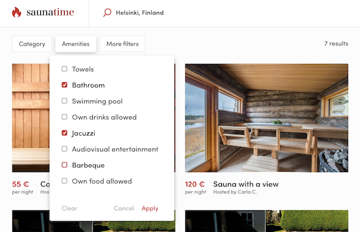
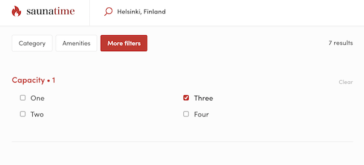
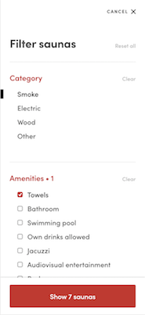

The search experience can be improved by adding search filters to narrow
down the results. The filters rely on listing's indexed data.

## Filter types

The Flex template for web has different filter types: _price_, _date
range_, _select single_ and _select multiple_. Select single and select
multiple filters are generic in a way that they can be used to filter
search results using different kinds of data. The price and date range
filters on the other hand are only used for filtering by price and date
range.

> **Note:** price filter should be configured from
> `src/marketplace-custom-config.js`. Current maximum value for the
> range is set to 1000 (USD/EUR).

Filters _select single_ and _select multiple_ can be used with extended
data. The _select single_ one can be used to filter out search results
with only one value per search parameter. The _select multiple_ filters
on the other hand can take multiple values for a single search
parameter. These two filter types for extended data are implemented with
two different components:

- Select single filter: `SelectSingleFilter`
- Select multiple filter: `SelectMultipleFilter`

## Adding a new search filter

Next we'll guide you through the steps of adding a _capacity_ filter to
the marketplace.

First step for adding a new filter is to make sure that the data being
used for filtering is saved in the listing's `publicData` attribute. On
how to achieve this, please refer to the
[How to extend listing data in FTW](/guides/how-to-extend-listing-data-in-ftw/)
guide. Another aspect in search filters is that the public data needs to
be indexed in the API. This is currently achieved with a manual
operation done by the Sharetribe support. Once a public data attribute
is added to the listings and the data attribute is indexed, the listing
searches can be filtered by that attribute by adding a query parameter
that consists of a preceding "pub\_" and the attribute name, so for the
_capacity_ attribute the parameter would be "pub_capacity".

Further reading on public data can be found in the
[How to extend listing data in FTW](/guides/how-to-extend-listing-data-in-ftw/)
guide.

> **Note:** Please contact the Sharetribe support in order to update
> your listing index schema when planning to use new listing fields as
> search filters.

### Common changes

A few common changes are required to add a select single or a select
multiple filter to desktop and mobile views.

First of all, the value options for the filter need to be defined. One
handy place to store these is the `marketplace-custom-config.js` file.
The correct format is a list of objects with `key` and `label` fields:

```js
export const capacityOptions = [
  {
    key: 'oneToThree',
    label: '1 to 3',
  },
  {
    key: 'fourToSix',
    label: '4 to 6',
  },
  ...
];
```

A few changes need to be made to the `SearchPage` container in order to
get the filters to work.

`SearchPage` needs the filter options. One handy way is to add the
options as a prop to the component and then set `defaultProps` value
from `config.custom` (contains the `marketplace-custom-config.js`
exports). This way tests can pass in their own values for the filter
options and filter option changes won't affect tests.

```js
SearchPageComponent.defaultProps = {
  // other default props
  capacityOptions: config.custom.capacityOptions,
};

SearchPageComponent.propTypes = {
  // other props
  capacityOptions: array,
};
```

Also a filter configuration needs to be added to the object returned by
the `filters` method. The `filters` method combines query param name and
options information of each filter so that those can be passed on to
subcomponents and used for validating the filter values and rendering
the filter components.

To add a filter configuration, extract the filter options from the props
and set the param name as the one defined in your extended data indexing
configuration:

```js
filters() {
  const { capacityOptions } = this.props;

  return {
    capacityFilter: {
      paramName: 'pub_capacity',
      options: capacityOptions,
    },
    ...
  };
}
```

Final thing to do in `SearchPage` is to pass the filters configuration
on to the components that take care of rendering the filters. This is
achieved by `primaryFilters` and `secondaryFilters` props that are
passed to `MainPanel`. The configurations are passed as an object in the
same form as the configuration object in `filters`.

```jsx
<MainPanel
  ...
  primaryFilters={{
    categoryFilter: filters.categoryFilter,
    amenitiesFilter: filters.amenitiesFilter,
  }}
  secondaryFilters={{
    capacityFilter: filters.capacityFilter,
  }}
/>
```

These props are used for resolving filter states and validating the
filter values. The contents are passed as props to the components that
render the filters: `SearchFilters`, `SearchFiltersPanel` and
`SearchFiltersMobile` .The difference between filters passed as primary
and secondary varies in mobile and desktop views:

- **Desktop:** Primary filters are shown in the top of the search view,
  secondary filters are rendered in a distinct panel that opens on top
  of search results.
- **Mobile:** Both primary and secondary filters are rendered in the
  same modal.

### Desktop filters



A basic desktop filter that renders as a dropdown button on top of the
search results panel is achieved using the `SelectSingleFilter` and
`SelectMultipleFilter` components. To add standard desktop filters,
perform the following in `SearchFilters` component:

- declare a prop with the same name that you added the filter config to
  `primaryFilters`
- resolve the filters initial value with `initialValue` and
  `initialValues` functions
- render the filter by using a `SelectSingleFilter` or
  `SelectMultipleFilter` component inside the
  `<div className={css.filters}>` element.

### Desktop filters panel



If more filters are required than can fit into the top filter bar, the
`SearchFiltersPanel` component can be used. It renders as a button in
the top filter bar that opens a new panel that can contain a set of
filters.

To use the `SearchFiltersPanel`, do the following:

- declare a prop with the same name that you added the filter config to
  `secondaryFilters`
- resolve the filters initial value with `initialValue` and
  `initialValues` methods
- use the `SelectSingleFilter` and `SelectMultipleFilter` components
  inside the `<div className={css.filtersWrapper}>` element to render
  the filters.

### Mobile filters



The mobile view uses the same `SelectSingleFilter` and
`SelectMultipleFilter` components as the filter panel. In this case the
filter components are declared in `SearchFiltersMobile`. The following
steps are required to add a mobile filter:

- declare a prop with the same name that you added the filter config to
  `primaryFilters` or `secondaryFilters`
- resolve the filters initial value with `initialValue` and
  `initialValues` methods
- use the `SelectSingleFilter` and `SelectMultipleFilter` components
  inside the `<div className={css.filtersWrapper}>` element to render
  the filters.

## Creating your own filter types

If you are creating new filter types note that we are using two
different types of components: popup and plain. Popup components are
rendered as primary dropdowns in the search view in `SearchFilters`.
Plain components are used with `SearchFiltersMobile` and
`SearchFiltersPanel`. `SearchFiltersPanel` opens sacondary filters in a
distinct panel in order to fit additional filters to the desktop search
view.

To make creating new filters easier, there are two generic components:
`FilterPoup` and `FilterPlain`. These components expect that you give
form fields as child component. Check `SelectMultipleFilter` to see how
these components work.
