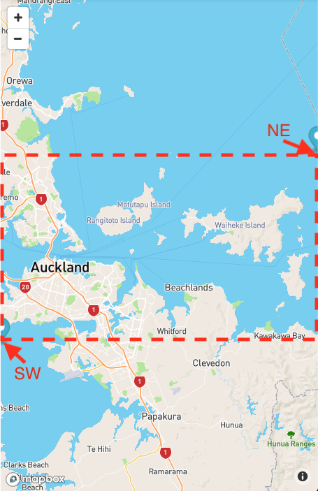

When you make a location search, you notice that there are some default
locations suggested:


These default locations improve UX since users don't need to type
anything and they guide users to the most popular locations in your
marketplace.

We want to change those since our CottageDays marketplace operates in
different locations than Saunatime. Let's change the first suggestion:
_"Helsinki, Finland"_ to _"Auckland, New Zealand"_.

## Change default-location-searches.js

The component, that actually makes geocoding calls to the map providers
geocoding API, is called _LocationAutocompleteInput_. However, the
default locations are actually set in a file called
_default-location-searches.js_:

```shell
└── src
    └── default-location-searches.js
```

In that file use see those locations listed inside an array returned as
default export:

```js
export default [
  {
    id: 'default-helsinki',
    predictionPlace: {
      address: 'Helsinki, Finland',
      bounds: new LatLngBounds(
        new LatLng(60.29783, 25.25448),
        new LatLng(59.92248, 24.78287)
      ),
    },
  },
  // the rest of the default locations.
];
```

There are two strings (_id_ and _address_) that are pretty easy to
change, but it also contains a _bounds_ object. This bounds object
contains two LatLng coordinates (NE, and SW) which create a bounding box
for the area that will be shown on the _SearchMap_ component.


If you search for Auckland and check the URL it generates, you find the
value of **bounds** parameter from there too. It should be something
like `-36.685119%2C175.228302%2C-36.960217%2C174.658896` and when you
URL decode that string it gives
`-36.685119,175.228302,-36.960217,174.658896`.

The first two values are the north-east corner of the search area (aka
bounding box) and the last two coordinates are south-west corner. The
map component will find a zoom-level that fits the specified bounding
box inside its current viewport. So, it actually shows a little bit
bigger area than what the bounding box states.

In the next screenshot, the search map has a narrow aspect ratio.
Therefore, the bounding box for Auckland takes the whole width, but not
the whole height:



We could manually change this bounding box a bit. Let's use **-36.545,
175.298** for _NE_ and **-37.047, 174.498** for _SW_.

Then we can just change the first default location (previously Helsinki)
to point to Auckland:

```js
{
  id: 'default-auckland',
  predictionPlace: {
    address: 'Auckland, New Zealand',
    bounds: new LatLngBounds(new LatLng(-36.545, 175.298), new LatLng(-37.047,174.498)),
  },
},
```

The result should look like this:


You can change the other locations in a similar fashion.

## Other hard-coded links with a location search

There are hard-coded links to search page from other components too.
Check at least these:

- **Footer** component

    <extrainfo title="Extra: adjust locations listed in Footer component">

  ```shell
  └── src
      └── components
          └── Footer
              └── Footer.js
  ```

  _Footer_ has hard-coded links to the search page. These links use
  _NamedLink_ component, which just gets the full list of _search_
  params:

  ```js
  <NamedLink
    name="SearchPage"
    to={{
      search:
        '?address=Helsinki%2C%20Finland&bounds=60.2978389%2C25.254484899999966%2C59.9224887%2C24.782875800000056&origin=60.16985569999999%2C24.93837910000002',
    }}
    className={css.link}
  >
    <FormattedMessage id="Footer.searchHelsinki" />
  </NamedLink>
  ```

  > **Note**: origin is an unnecessary search parameter with the default
  > configuration of FTW templates.

  You also need to create a new translation key. E.g.
  _'Footer.searchAuckland'_ and add it to the translation file.

    </extrainfo>

- **SectionLocations** component (used on landing page)

    <extrainfo title="Extra: adjust locations listed in SectionLocations component">

  ```shell
  └── src
      └── components
          └── SectionLocations
              └── SectionLocations.js
  ```

  _SectionLocations_ component has hard-coded links to the search page.
  These links use _NamedLink_ component through a helper function
  (_locationLink_):

  ```js
  {
    locationLink(
      'Helsinki',
      helsinkiImage,
      '?address=Helsinki%2C%20Finland&bounds=60.2978389%2C25.254484899999966%2C59.9224887%2C24.782875800000056&origin=60.16985569999999%2C24.93837910000002'
    );
  }
  ```

  This section also needs new images:

  ```js
  // Remove the current (helsinki) image:
  // import helsinkiImage from './images/location_helsinki.jpg';

  // Find a new image and save it with dimensions: 648x448
  import aucklandImage from './images/location_auckland.jpg';
  ```

    </extrainfo>

On search page, you can use different kind of filters. In the next
article you learn how to update the options for amenities filter.<br />
[› Go to the next article](/tutorial-branding/configurations/)
