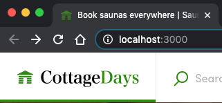

## Change Logo component

Components can be found from one of the three directories:

- **containers**: Page-level components and TopbarContainer are
  [Redux container components](https://redux.js.org/basics/usage-with-react#presentational-and-container-components).
- **forms**: Form components. (These use Final Form.)
- **components**: Other presentational components.

Logo is a presentational component and it can be found from components
directory:

```shell
└── src
    ├── components
    │   └── Logo
    │       ├── IconLogo.js
    │       ├── Logo.css
    │       ├── Logo.js
    │       └── saunatime-logo.png
    ├── containers
    └── forms
```

The main component has the same name as the directory it lies:
Logo/Logo.js. If you open that file, you'll notice that it imports 2
logo-files from the same directory:

```js
import IconLogo from './IconLogo';
import LogoImage from './saunatime-logo.png';
```

The first one (_IconLogo_) doesn't have a file extension, which means
that it's referring to **IconLogo.js** file. If you open it, you see
that it contains Scalable Vector Graphics (SVG) content inside React
component.

The other import (_LogoImage_) is referring to a normal PNG image.

_IconLogo_ is used for mobile layout and PNG is for desktop layout.
There's no real reason behind this double format setup - it is just
there to show 2 different ways to create graphics. Although, the SVG
format is a bit better choice for logo since it stays sharp when scaled
bigger.

However, in this tutorial, we'll use raster images (PNGs):

- [CottageDays mobile logo](/tutorial-assets/cottagedays-logo-small.png)
- [CottageDays desktop logo](/tutorial-assets/cottagedays-logo.png)

Save those files to _Logo_ directory, and then change the imports:

```js
import MobileLogoImage from './cottagedays-logo-small.png';
import DesktopLogoImage from './cottagedays-logo.png';
```

You also need to change the places where the previously imported logos
were used. Since we use PNGs in this tutorial, we just need plain
`` elements. Therefore, we can simplify the function component a
bit.

First of all, class _.logoMobile_ (inside Logo.css) needs to be changed.
Previously, it just adjusted styles for SVG _paths_, which we don't have
anymore. However, IconLogo component had a height explicitly defined in
its _props_. It was 25px tall, so we should use that.

```css
.logoMobile {
  height: 25px;
}
```

Then we can simplify the Logo component itself:

```js
const Logo = props => {
  const { className, format, ...rest } = props;
  const isMobile = format !== 'desktop';
  const classes = classNames(className, { [css.logoMobile]: isMobile });
  const logoImage = isMobile ? MobileLogoImage : DesktopLogoImage;

  return (
    
  );
};
```

<extrainfo title="Check the whole Logo.js file">

```js
import React from 'react';
import { oneOf, string } from 'prop-types';
import classNames from 'classnames';

import config from '../../config';
import MobileLogoImage from './cottagedays-logo-small.png';
import DesktopLogoImage from './cottagedays-logo.png';
import css from './Logo.css';

const Logo = props => {
  const { className, format, ...rest } = props;
  const isMobile = format !== 'desktop';
  const classes = classNames(className, { [css.logoMobile]: isMobile });
  const logoImage = isMobile ? MobileLogoImage : DesktopLogoImage;

  return (
    
  );
};

Logo.defaultProps = {
  className: null,
  format: 'desktop',
};

Logo.propTypes = {
  className: string,
  format: oneOf(['desktop', 'mobile']),
};

export default Logo;
```

</extrainfo>

After those changes, you should see the updated Logo:



Logo component is used in several places. Check these locations to
verify that your changes don't break anything:

- **Topbar** - Both desktop and mobile layout. The breakpoint is at
  768px.
- **Footer**
- **CheckoutPage** - This page has its own Topbar component.

## Troubleshooting

If your logo has a completely different aspect ratio, you might need to
change the paddings and other styles that are used to style the parent
component of the Logo. E.g. you might need to adjust the _paddings_ so
that the component doesn't overflow from the area reserved for Topbar.

The easiest way to figure out styles related to any component is to use
the browser's Web Inspector and check the classes that affect the
component.


**Useful tip**:<br > FTW templates use
[CSS Modules](https://github.com/css-modules/css-modules) instead of
plain CSS for styling components. CSS Modules creates unique class names
for the rendered component - and those class name strings are in format:
**`<ComponentName>_<className>__<hash>`**.

So, you can backtrack the correct component from the class name. In the
example image above: the component which provides the paddings rule is
_TopbarDesktop_.

## Styling other components

Creating a new visual brand needs a lot of changes to existing
components. You should read the following article to understand **_how
to customize FTW styles_**: <br />
[/guides/how-to-customize-ftw-styles/](/guides/how-to-customize-ftw-styles/)

Especially, you should check
[the best practices topic](/guides/how-to-customize-ftw-styles/#styling-guidelines-and-good-practices)
to check the philosophy of how the existing components are styled.
