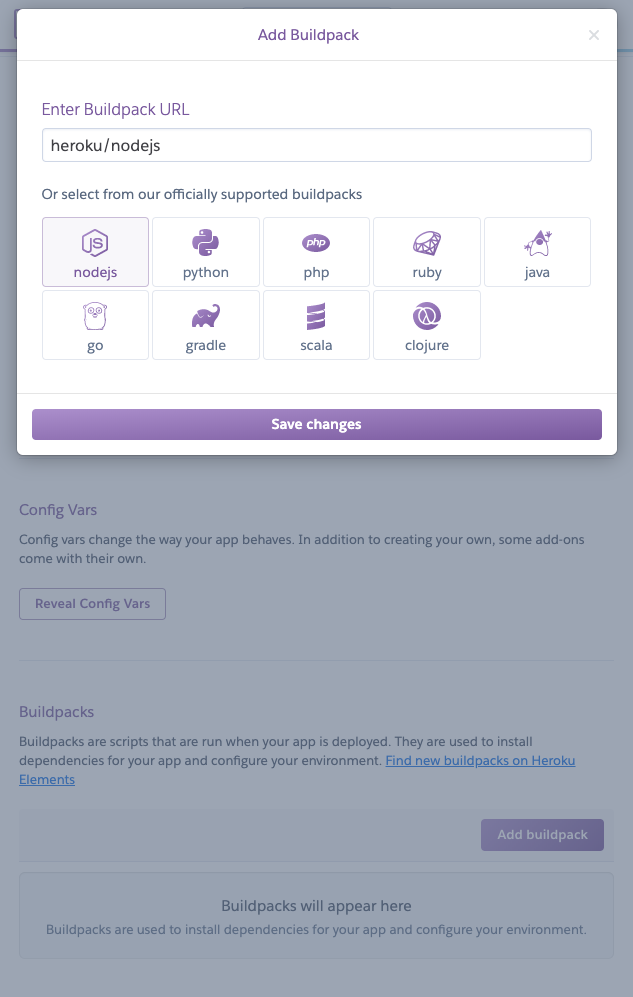

Now we have branded FTW-daily template to _CottageDays_ marketplace.
It's time to deploy the web app to some hosting service. After all, we
want to get some feedback from colleagues and friends.

**Note**: if you have removed all the Saunatime related content from
your client app and your marketplace doesn't need more advanced
functionality to work, you should consider launching your marketplace.
If you want to read more, there's a Marketplace Academy article about
[why you should launch your marketplace early](https://www.sharetribe.com/academy/why-you-should-launch-your-marketplace-early/).

## Test server-side rendering locally

Before we push the code to Heroku or another hosting service, we need to
make sure that the server-side rendering (SSR) works.

FTW templates come with small Node/Express server that renders the
public pages on the server. This makes it faster to render the page, but
even more importantly search engines can read the content (in case they
don't execute JavaScript).

Previously used command, **yarn run dev**, doesn't start this Node.js
server but uses Webpack's dev-server with hot module replacement
functionality. There's a different package.json script that starts the
actual server:

```shell
yarn run dev-server
```

Then test that the application works on different pages.

<extrainfo title="Extra: troubleshooting">

If the server-side rendering doesn't work, it is likely that you have
called functions that belong to "**window**" object/scope. In the server
environment, "window" object is not available.

</extrainfo>

## Deploy to Heroku

Generic Heroku deployment has the following steps:

**Step 1: Create a Heroku account**

Go to Heroku and create a new account if you don't have one. There's a
[free plan available](https://www.heroku.com/pricing).

**Step 2: Create a new app**

Create a new app in Heroku dashboard.


**Step 3: Change environment variables**

In Heroku, you can configure environment variables from the
[Heroku dashboard](https://devcenter.heroku.com/articles/config-vars#using-the-heroku-dashboard).

Go to the Settings page of your new app and reveal Config Vars:


Then add the following environment variables as Config Vars:

- `REACT_APP_SHARETRIBE_SDK_CLIENT_ID`

  Flex Client ID. Check this from
  [Console](https://flex-console.sharetribe.com/applications).

- `REACT_APP_STRIPE_PUBLISHABLE_KEY`

  Stripe publishable API key for generating tokens with Stripe API. Use
  the test key (prefix `pk_test`) for development.

- `REACT_APP_MAPBOX_ACCESS_TOKEN`

  If you are using Mapbox instead of Google Maps

- `REACT_APP_SHARETRIBE_MARKETPLACE_CURRENCY`

  The currency used in the Marketplace as ISO 4217 currency code. For
  example USD, EUR, CAD, AUD, etc.

- `REACT_APP_CANONICAL_ROOT_URL`

  Canonical root URL of the marketplace. Remove trailing slash from the
  domain.<br />E.g. _`https://<the-name-of-your-app>.herokuapp.com`_

- `NODE_ENV`

  Node environment is used to build the app. Use 'development' for
  development and 'production' for production.<br/> Use value:
  'production'

- `REACT_APP_ENV`

  A more fine-grained env definition than `NODE_ENV`. For example, this
  is used to send environment info to logging service: Sentry. (If you
  have enabled it with `REACT_APP_SENTRY_DSN`).<br/> For this setup, use
  value: 'development'

- `REACT_APP_SHARETRIBE_USING_SSL`

  Redirect HTTP to HTTPS?<br/> Use value: true

- `SERVER_SHARETRIBE_TRUST_PROXY`

  Set this when running the app behind a reverse proxy, e.g. in
  Heroku.<br/> Use value: true

- `REACT_APP_CSP`

  Content Security Policy (CSP). Read more from
  [this article](/ftw-security/how-to-set-up-csp-for-ftw/).<br /> Accepts
  values: _block_ and _report_. The recommended value is _block_.

- `REACT_APP_AVAILABILITY_ENABLED`

  Possible values: true/false<br/> Use value: true

- `REACT_APP_DEFAULT_SEARCHES_ENABLED`

  Possible values: true/false<br/> Use value: true

If you change these values later on, _you need to deploy the app again_.
Environment variables are baked into the static build files of the
webapp - so, a new build is needed.

**Step 4: Add Node.js buildpack**

Go to the Settings page of your new app and add official buildpack:
_heroku/nodejs_



**Step 5: Connect the Heroku app to Github**

Go to the Deploy page of your new app and
[connect the app with Github](https://devcenter.heroku.com/articles/github-integration#enabling-github-integration).


After that, you can deploy the app manually or enable automatic deploy
from your master branch.

If everything works, your app should be available in URL that looks a
bit like this: `https://<your-app-name>.herokuapp.com`

## What you should do next?

You should test the app fully with both desktop layout and mobile
layout:

- Create new users
- Create new listings
- Book listings
- Test social sharing
  - [Facebook sharing debugger](https://developers.facebook.com/tools/debug/)
  - [Twitter card validator](https://cards-dev.twitter.com/validator)
- Save payment card

  Use [test card numbers](https://stripe.com/docs/testing).

If your marketplace concept needs advanced features, you need to
continue with customizations. You could:

- [Extend listings](/cookbook-data-model/extend-listing-data-in-ftw/) with
  your own data
- [Edit email templates](/flex-cli/edit-email-templates-with-flex-cli/)
- Add more
  [search filters](/cookbook-search/change-search-filters-in-ftw/)
- [Customize pricing](/background/custom-pricing/)
- [Customize the transaction process](background/transaction-process/)
